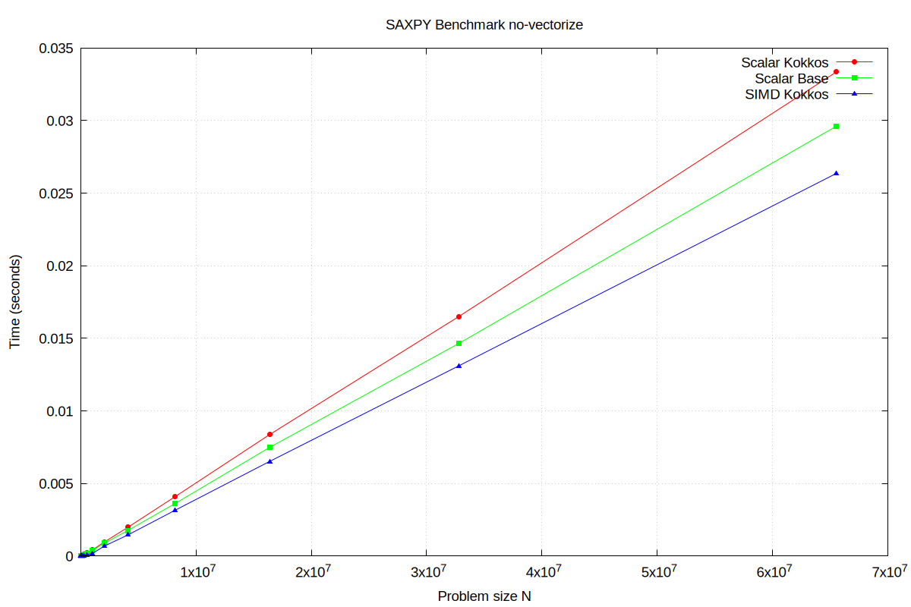
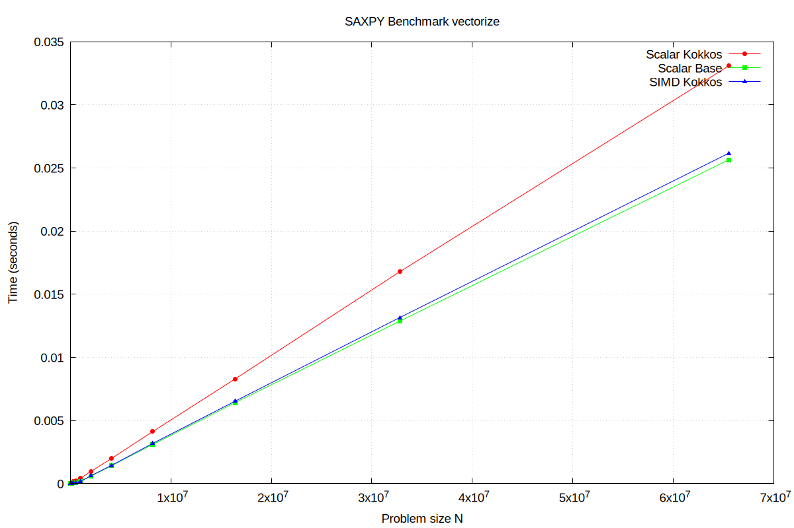

# SAXPY Benchmark with Kokkos Scalar, Kokkos SIMD and Base C++ 

This project benchmarks the **SAXPY** operation (`y = a * x + y`) using different implementations:

1. **Scalar Kokkos** – a simple Kokkos `parallel_for` with a serial loop.
2. **SIMD Kokkos** – a Kokkos `parallel_for` leveraging SIMD vectorization.
3. **Scalar Base** – a standard C++ loop without Kokkos.

The goal is to compare across these three kernels, mainly:
- the overhead of the Scalar Kokkos abstraction overhead
- the performance gain between a regular C++ loop (vectorized and non vectorized)

The project is build with compiler flags:
- `-O3 -march=native -fno-tree-vectorize` 
- `-O3 -march=native -ftree-vectorize` 

The benchmarks record execution time for varying problem sizes N = (1000 -> 65,536,000) and **repeated** `REPEAT_COUNT=8` times and averaged (no warm up).

## System Info

[https://www.intel.com/content/www/us/en/products/sku/237330/intel-core-ultra-5-processor-125u-12m-cache-up-to-4-30-ghz/specifications.html]
[https://www.cpubenchmark.net/cpu.php?cpu=Intel+Core+Ultra+5+125U&id=5840]

| **Specification**                     | **Value**                          |
|--------------------------------------|------------------------------------|
| **Product Collection**               | Intel® Core™ Ultra processors (Series 1) |
| **Code Name**                        | Products formerly Meteor Lake      |
| **Vertical Segment**                 | Mobile                             |
| **Processor Number**                 | 125U                               |
| **Overall Peak TOPS (Int8)**          | 21                                 |
| **Total Cores**                      | 12                                 |
| **# of Performance-cores**           | 2                                  |
| **# of Efficient-cores**             | 8                                  |
| **# of Low Power Efficient-cores**   | 2                                  |
| **Total Threads**                    | 14                                 |
| **Max Turbo Frequency**              | 4.3 GHz                            |
| **Performance-core Max Turbo Frequency** | 4.3 GHz                        |
| **Efficient-core Max Turbo Frequency**  | 3.6 GHz                        |
| **Low Power Efficient-core Max Turbo Frequency** | 2.1 GHz      |
| **Performance-core Base Frequency**   | 1.3 GHz                            |
| **Efficient-core Base Frequency**    | 800 MHz                            |
| **Low Power Efficient-core Base Frequency** | 700 MHz               |
| **Cache**                            | 12 MB Intel® Smart Cache            |
| **Processor Base Power**             | 15 W                               |
| **Maximum Turbo Power**              | 57 W                               |
| **Minimum Assured Power**            | 12 W                               |
| **Intel® Deep Learning Boost (Intel® DL Boost) on CPU** | Yes       |
| **AI Software Frameworks Supported by CPU** | OpenVINO™, WindowsML, ONNX RT |
| **CPU Lithography**                  | Intel 4                            |
| L1 Cache |64KB|
| L2 Cache |2048KB|
| L3 Cache |12MB|

### cpuinfo flags

- lm: Long Mode -> 64-bit architecture
- smx: Safer Mode Extensions -> chipset that provides enforcement of protection mechanisms
- pae: Physical Address Extension -> allows our CPUs to access physical memory sizes greater than 4 GB
- acpi: Advanced Configuration and Power Interface -> discover and configure computer hardware components, to perform power management]
(e.g. putting unused hardware components to sleep), auto configuration (e.g. plug and play and hot swapping), and status monitoring.
- sse: Streaming SIMD Extension -> allows for SIMD
- sse2: Unlike SSE, SSE2 is capable of handling 64-bit value. +144 instructions
- sse3: +13 new instructions
- sse4_1 and sse4_2: HD Boost -> contain subsets of 54 new instructions.
- ht: Hyper-Threading -> Only on P-cores (CPU0/1, CPU2/3).
- tm + tm2: Thermal Monitor -> reduces its thermal output by reducing its clock speed
- pdcm: Perfomance and Debugging Capabilities MSR (Model-Specific Register) -> debugging and benchmarks

## Results

> Note: the Cache Levels are purely assumed for the vector size and cpu cache sizes

###  Non-vectorized `-O3 -march=native -fno-tree-vectorize`

| N        | Vector Size (Bytes) | Cache Level | scalar_kokkos | --->   | scalar_base | --->   | simd_kokkos |
| -------- | ------------------- | ----------- | ------------- | ------ | ----------- | ------ | ----------- |
| 1000     | 4000                | L1          | 7.83375e-07   | x2.066 | 3.7925e-07  | x1.167 | 3.24875e-07 |
| 2000     | 8000                | L1          | 1.28013e-06   | x1.669 | 7.67e-07    | x1.867 | 4.1075e-07  |
| 4000     | 16000               | L1          | 2.43375e-06   | x1.61  | 1.512e-06   | x1.941 | 7.79e-07    |
| 8000     | 32000               | L1          | 4.35925e-06   | x1.651 | 2.641e-06   | x2.034 | 1.29825e-06 |
| 16000    | 64000               | L1          | 8.60475e-06   | x1.487 | 5.78812e-06 | x2.57  | 2.25262e-06 |
| 32000    | 128000              | L2          | 1.56214e-05   | x1.369 | 1.14077e-05 | x2.757 | 4.13738e-06 |
| 64000    | 256000              | L2          | 3.19179e-05   | x1.176 | 2.71376e-05 | x3.466 | 7.829e-06   |
| 128000   | 512000              | L2          | 6.18301e-05   | x1.132 | 5.46039e-05 | x3.536 | 1.54422e-05 |
| 256000   | 1024000             | L2          | 0.000145114   | x1.694 | 8.56502e-05 | x2.778 | 3.08355e-05 |
| 512000   | 2048000             | L2          | 0.000216636   | x1.152 | 0.000188108 | x2.112 | 8.90504e-05 |
| 1024000  | 4096000             | L3          | 0.000441651   | x1.06  | 0.000416661 | x2.278 | 0.000182877 |
| 2048000  | 8192000             | L3          | 0.0010495     | x1.245 | 0.000843264 | x1.259 | 0.000669591 |
| 4096000  | 16384000            | RAM         | 0.00206447    | x1.213 | 0.00170187  | x1.201 | 0.00141736  |
| 8192000  | 32768000            | RAM         | 0.00414785    | x1.161 | 0.00357322  | x1.129 | 0.00316385  |
| 16384000 | 65536000            | RAM         | 0.00838772    | x1.131 | 0.00741844  | x1.136 | 0.0065303   |
| 32768000 | 131072000           | RAM         | 0.0166074     | x1.119 | 0.0148421   | x1.123 | 0.0132192   |
| 65536000 | 262144000           | RAM         | 0.0334611     | x1.138 | 0.0294032   | x1.126 | 0.0261171   |

  

###  Vectorized `-O3 -march=native -ftree-vectorize`

| N        | Vector Size (Bytes) | Cache Level | scalar_kokkos | --->   | scalar_base | --->   | simd_kokkos |
| -------- | ------------------- | ----------- | ------------- | ------ | ----------- | ------ | ----------- |
| 1000     | 4000                | L1          | 7.845e-07     | x5.758 | 1.3625e-07  | x0.39  | 3.495e-07   |
| 2000     | 8000                | L1          | 1.14975e-06   | x5.398 | 2.13e-07    | x0.556 | 3.83375e-07 |
| 4000     | 16000               | L1          | 2.46037e-06   | x4.116 | 5.9775e-07  | x0.779 | 7.67625e-07 |
| 8000     | 32000               | L1          | 4.48637e-06   | x3.91  | 1.1475e-06  | x0.824 | 1.39263e-06 |
| 16000    | 64000               | L1          | 7.93613e-06   | x3.763 | 2.109e-06   | x0.931 | 2.26625e-06 |
| 32000    | 128000              | L2          | 1.56444e-05   | x3.9   | 4.011e-06   | x0.967 | 4.1485e-06  |
| 64000    | 256000              | L2          | 3.15179e-05   | x4.081 | 7.72225e-06 | x0.983 | 7.85325e-06 |
| 128000   | 512000              | L2          | 6.20054e-05   | x4.071 | 1.52324e-05 | x0.961 | 1.58452e-05 |
| 256000   | 1024000             | L2          | 0.000148457   | x5.549 | 2.67544e-05 | x0.93  | 2.87776e-05 |
| 512000   | 2048000             | L2          | 0.000215326   | x2.446 | 8.80493e-05 | x0.998 | 8.82391e-05 |
| 1024000  | 4096000             | L3          | 0.000431681   | x2.144 | 0.000201337 | x1.059 | 0.000190103 |
| 2048000  | 8192000             | L3          | 0.00103628    | x1.551 | 0.000667986 | x0.986 | 0.000677472 |
| 4096000  | 16384000            | RAM         | 0.00198061    | x1.431 | 0.0013839   | x0.964 | 0.00143629  |
| 8192000  | 32768000            | RAM         | 0.00411931    | x1.333 | 0.00308983  | x0.983 | 0.00314292  |
| 16384000 | 65536000            | RAM         | 0.00844726    | x1.259 | 0.00670839  | x1.03  | 0.00651282  |
| 32768000 | 131072000           | RAM         | 0.0166278     | x1.294 | 0.0128514   | x0.986 | 0.0130389   |
| 65536000 | 262144000           | RAM         | 0.0332196     | x1.301 | 0.0255407   | x0.98  | 0.0260527   |

  
