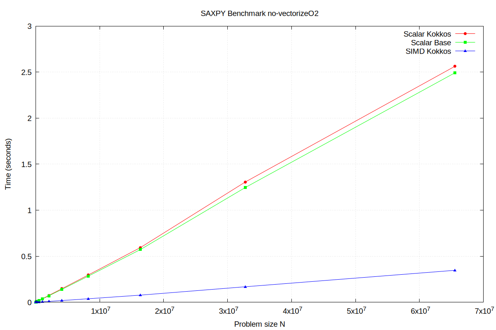
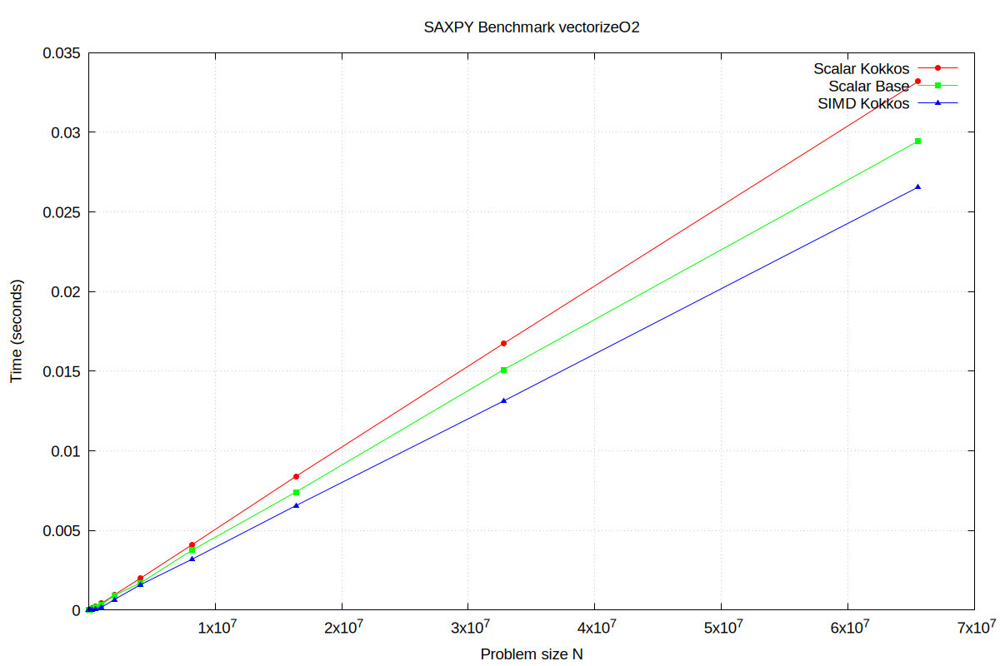

# SAXPY Benchmark with Kokkos Scalar, Kokkos SIMD and Base C++ 

This project benchmarks the **SAXPY** operation (`y = a * x + y`) using different implementations:

1. **Scalar Kokkos** – a simple Kokkos `parallel_for` with a serial loop.
2. **SIMD Kokkos** – a Kokkos `parallel_for` leveraging SIMD vectorization.
3. **Scalar Base** – a standard C++ loop without Kokkos.

The goal is to compare **performance** across these methods and observe the effects of compiler optimization flags:

- `-O2 -march=native`
  - Kokkos SIMD vectorization improved
  - Scalar Base + Scalar Kokkos vectorized by the compiler

- `-fno-tree-vectorize` 
  - Kokkos SIMD will still vectorize
  - Scalar Base + Scalar Kokkos no vectorized by the compiler

The benchmarks record execution time for varying problem sizes N = (1000 -> 65,536,000) and **repeated** `REPEAT_COUNT=8` times and averaged (no warm up).
The results are presented as:

* **Plots** – showing time vs. problem size for each implementation using `gnuplot`.
* **Tables** – including speedups and assumed (not verified) cache levels based on vector size


By evaluating these configurations across increasing problem sizes, this project highlights the trade-offs between abstraction overhead, explicit SIMD
vectorization, and compiler-driven optimizations in a simple but representative numerical kernel.


> we will use the namespace `namespace KE = Kokkos::Experimental;` 

With this specific CPU, the value of `KE::simd_size` given we have initialized with `KE::simd<int>` is **8**.
It is expected that there will be a speed up of ~x8 for the **Kokkos SIMD** kernel with **non-vectorized** flags.
This value is expected to drop when building with the `-O2 -march=native` flags


## File Structure

```
├── CMakeLists.txt
├── include
│   └── gnuplot.h
├── README.md
├── results
└── src
    ├── consts.hh
    ├── kernals.cc
    ├── kernals.hh
    ├── main.cc
    ├── scoped_timer.cc
    ├── scoped_timer.hh
    ├── utils.cc
    └── utils.hh
```

## System Info

[https://www.intel.com/content/www/us/en/products/sku/237330/intel-core-ultra-5-processor-125u-12m-cache-up-to-4-30-ghz/specifications.html]

| **Specification**                     | **Value**                          |
|--------------------------------------|------------------------------------|
| **Product Collection**               | Intel® Core™ Ultra processors (Series 1) |
| **Code Name**                        | Products formerly Meteor Lake      |
| **Vertical Segment**                 | Mobile                             |
| **Processor Number**                 | 125U                               |
| **Overall Peak TOPS (Int8)**          | 21                                 |
| **Total Cores**                      | 12                                 |
| **# of Performance-cores**           | 2                                  |
| **# of Efficient-cores**             | 8                                  |
| **# of Low Power Efficient-cores**   | 2                                  |
| **Total Threads**                    | 14                                 |
| **Max Turbo Frequency**              | 4.3 GHz                            |
| **Performance-core Max Turbo Frequency** | 4.3 GHz                        |
| **Efficient-core Max Turbo Frequency**  | 3.6 GHz                        |
| **Low Power Efficient-core Max Turbo Frequency** | 2.1 GHz      |
| **Performance-core Base Frequency**   | 1.3 GHz                            |
| **Efficient-core Base Frequency**    | 800 MHz                            |
| **Low Power Efficient-core Base Frequency** | 700 MHz               |
| **Cache**                            | 12 MB Intel® Smart Cache            |
| **Processor Base Power**             | 15 W                               |
| **Maximum Turbo Power**              | 57 W                               |
| **Minimum Assured Power**            | 12 W                               |
| **Intel® Deep Learning Boost (Intel® DL Boost) on CPU** | Yes       |
| **AI Software Frameworks Supported by CPU** | OpenVINO™, WindowsML, ONNX RT |
| **CPU Lithography**                  | Intel 4                            |


### cpuinfo flags

- lm: Long Mode -> 64-bit architecture
- smx: Safer Mode Extensions -> chipset that provides enforcement of protection mechanisms
- pae: Physical Address Extension -> allows our CPUs to access physical memory sizes greater than 4 GB
- acpi: Advanced Configuration and Power Interface -> discover and configure computer hardware components, to perform power management]
(e.g. putting unused hardware components to sleep), auto configuration (e.g. plug and play and hot swapping), and status monitoring.
- sse: Streaming SIMD Extension -> allows for SIMD
- sse2: Unlike SSE, SSE2 is capable of handling 64-bit value. +144 instructions
- sse3: +13 new instructions
- sse4_1 and sse4_2: HD Boost -> contain subsets of 54 new instructions.
- ht: Hyper-Threading -> Only on P-cores (CPU0/1, CPU2/3).
- tm + tm2: Thermal Monitor -> reduces its thermal output by reducing its clock speed
- pdcm: Perfomance and Debugging Capabilities MSR (Model-Specific Register) -> debugging and benchmarks


## Results

> Note: the Cache Levels are purely assumed for the vector size and cpu cache sizes

###  Non-vectorized `-fno-tree-vectorize`

  

| N        | Vector Size (Bytes) | Cache Level | scalar_kokkos | --->   | scalar_base | --->   | simd_kokkos |
| -------- | ------------------- | ----------- | ------------- | ------ | ----------- | ------ | ----------- |
| 1000     | 4000                | L1          | 3.49955e-05   | x1.03  | 3.39736e-05 | x6.235 | 5.44875e-06 |
| 2000     | 8000                | L1          | 6.56589e-05   | x1.059 | 6.20241e-05 | x6.409 | 9.67838e-06 |
| 4000     | 16000               | L1          | 0.000133143   | x0.801 | 0.000166153 | x8.652 | 1.9203e-05  |
| 8000     | 32000               | L1          | 0.000273967   | x1.07  | 0.000255983 | x6.513 | 3.93034e-05 |
| 16000    | 64000               | L1          | 0.000553742   | x1.055 | 0.000524758 | x7.109 | 7.38133e-05 |
| 32000    | 128000              | L2          | 0.00110896    | x1.047 | 0.00105956  | x7.147 | 0.000148247 |
| 64000    | 256000              | L2          | 0.00221701    | x0.98  | 0.00226125  | x7.689 | 0.000294102 |
| 128000   | 512000              | L2          | 0.0045285     | x1.048 | 0.00431963  | x7.103 | 0.000608149 |
| 256000   | 1024000             | L2          | 0.00931726    | x1.015 | 0.00917532  | x7.779 | 0.00117949  |
| 512000   | 2048000             | L2          | 0.0183827     | x1.048 | 0.0175331   | x7.428 | 0.00236035  |
| 1024000  | 4096000             | L3          | 0.0365822     | x1.046 | 0.0349642   | x7.542 | 0.00463613  |
| 2048000  | 8192000             | L3          | 0.0747299     | x1.066 | 0.0700705   | x7.499 | 0.00934396  |
| 4096000  | 16384000            | RAM         | 0.147121      | x1.052 | 0.139825    | x7.465 | 0.0187317   |
| 8192000  | 32768000            | RAM         | 0.295174      | x1.044 | 0.282757    | x7.433 | 0.0380384   |
| 16384000 | 65536000            | RAM         | 0.594494      | x1.038 | 0.572843    | x7.381 | 0.0776088   |
| 32768000 | 131072000           | RAM         | 1.30602       | x1.048 | 1.24598     | x7.394 | 0.168517    |
| 65536000 | 262144000           | RAM         | 2.56211       | x1.028 | 2.49136     | x7.178 | 0.347097    |


### Vectorized `-O2 -march=native`


  

| N        | Vector Size (Bytes) | Cache Level | scalar_kokkos | --->   | scalar_base | --->   | simd_kokkos |
| -------- | ------------------- | ----------- | ------------- | ------ | ----------- | ------ | ----------- |
| 1000     | 4000                | L1          | 7.955e-07     | x1.309 | 6.07875e-07 | x1.861 | 3.26625e-07 |
| 2000     | 8000                | L1          | 1.14525e-06   | x0.998 | 1.14712e-06 | x3.047 | 3.765e-07   |
| 4000     | 16000               | L1          | 2.14e-06      | x0.913 | 2.34287e-06 | x3.351 | 6.99125e-07 |
| 8000     | 32000               | L1          | 4.0655e-06    | x0.851 | 4.77762e-06 | x3.692 | 1.294e-06   |
| 16000    | 64000               | L1          | 7.92763e-06   | x0.81  | 9.79e-06    | x4.296 | 2.27875e-06 |
| 32000    | 128000              | L2          | 1.62162e-05   | x0.842 | 1.92669e-05 | x4.442 | 4.337e-06   |
| 64000    | 256000              | L2          | 3.10964e-05   | x0.812 | 3.8315e-05  | x4.884 | 7.84438e-06 |
| 128000   | 512000              | L2          | 6.21021e-05   | x1.554 | 3.99548e-05 | x2.453 | 1.62906e-05 |
| 256000   | 1024000             | L2          | 9.72465e-05   | x1.127 | 8.63142e-05 | x2.609 | 3.30864e-05 |
| 512000   | 2048000             | L2          | 0.00020968    | x1.132 | 0.000185168 | x2.069 | 8.949e-05   |
| 1024000  | 4096000             | L3          | 0.000412608   | x1.218 | 0.000338689 | x1.891 | 0.000179111 |
| 2048000  | 8192000             | L3          | 0.000963349   | x1.038 | 0.000927944 | x1.396 | 0.000664695 |
| 4096000  | 16384000            | RAM         | 0.00199646    | x1.172 | 0.00170295  | x1.07  | 0.00159105  |
| 8192000  | 32768000            | RAM         | 0.00411123    | x1.092 | 0.0037655   | x1.177 | 0.00319833  |
| 16384000 | 65536000            | RAM         | 0.00839339    | x1.133 | 0.00740766  | x1.13  | 0.00655788  |
| 32768000 | 131072000           | RAM         | 0.0167206     | x1.109 | 0.0150775   | x1.15  | 0.0131152   |
| 65536000 | 262144000           | RAM         | 0.033178      | x1.127 | 0.0294324   | x1.109 | 0.0265466   |


